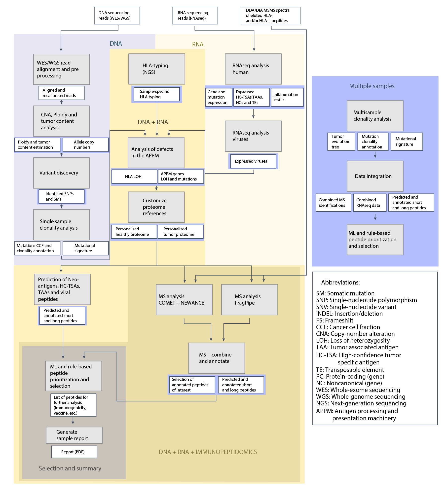

# NeoDisc

NeoDisc is a fast and modular computational pipeline, packaged within a Singularity container, that combines genomics, transcriptomics, and MS-based immunopeptidomics (optional) for the identification of immunogenic tumor-specific HLA-I and -II antigens from multiple sources (somatic mutations, tumor-associated antigens, viral antigens, and non-canonical antigens). It enables the assessment of both tumor heterogeneity and the functionality of the Antigen Processing and Presentation Machinery (APPM).



*Schematic overview of the NeoDisc pipeline.*

---

### Prioritization Performance

The ML algorithm integrated into NeoDisc enables precise prioritization of HLA-I neoantigens, outperforming other available tools.


*Comparison of performance in immunogenic neoantigen ranking with other available tools*

---

### Immunopeptidomics

NeoDisc supports immunopeptidomic data analysis for the identification of multiple sources of tumor-specific antigens.


*Heatmap of DIA-based quantification of HLA-I and HLA-II tumor-specific peptides in tissue samples and cell lines treated with control or IFNγ from a melanoma patient*

---

### Viral Infection

NeoDisc leverages RNA-seq data to identify evidence of viral infection, quantify viral gene expression, and efficiently prioritize viral antigens.


*Left: Expression levels of EBV genes in samples from a nasopharyngeal carcinoma patient . Right: Identified immunogenic EBV antigens (34 immunogenic, 108 tested), with their corresponding CD8/CD4 responses and HLA restrictions*

---

### Defects in the Antigen Presentation Machinery

NeoDisc calculates HLA-I and -II allele-specific copy numbers, reports HLA LOH events, and offers options to either retain or discard lost HLA alleles during peptide prioritization.


*HLA allele-specific copy number variations and expression levels in a melanoma tissue sample*


NeoDisc identifies and reports defects, including mutations and differential expression—based on comparisons with matched healthy tissue (GTEx) and matched tumor type (TCGA)—in genes involved in the antigen processing and presentation machinery.


*Defects and expression levels of APPM-related genes, with comparisons across healthy sun-exposed skin (GTEx), melanoma (TCGA), and multiple samples from a melanoma patient*

---

### Output and Report

NeoDisc generates a folder with output files and tables, lists of all MS-identified peptides and expressed genes, the VCFs, the personalized reference proteome fasta, as well as a comprehensive sample-specific PDF report. The report provides graphical representations of the results that summarize the analysis and important findings, and includes the prioritization tables.

An example is available [here](doc/report_example.pdf)

---

## System Requirements

1. **A Linux computer with sudo rights** - This is only required for the initial installation of NeoDisc. Once the installation is finished, NeoDisc should run on any Linux computer which satisfies the next two points.
2. **Install Singularity** - Required both on the installation and running computers. [See installation guide](https://docs.sylabs.io/guides/latest/user-guide/quick_start.html#quick-installation-steps).
3. **Ensure that user namespaces are enabled** on the running computer. [See guide on enabling user namespaces](https://docs.sylabs.io/guides/latest/admin-guide/user_namespace.html).
4. **Minimum 4 CPUs and 64G of RAM** on the running computer
5. **Follow the links provided in the manual** for the download and installation of proprietary software required by NeoDisc.
---

## Download

NeoDisc and the manual can be downloaded upon registration at [neodisc.unil.ch](https://neodisc.unil.ch/).

---

## Usage

1. Download NeoDisc and the manual from [here](https://neodisc.unil.ch/).
2. Follow the instructions in the manual for the installation.
3. Follow test cases in the manual (recommended).
4. Format NGS sequencing fastq filenames (as described in the manual)
5. Create a configuration file (run `./NeoDisc.sh GetConfigTemplate` to get a template )
6. Run NeoDisc pipeline
---

### NeoDisc runs with a command-line interface
The manual provides detailed instructions on formatting input files, creating the configuration file, and running NeoDisc.

NeoDisc offers two running modes, each executing specific modules of the pipeline, as described below:
- **fastq**: This mode starts from NGS sequencing fastq files and runs the entire pipeline, depending on the input data available.
- **panel**: This mode runs neoantigen predictions from formatted gene-panel data only.


Run `./NeoDisc.sh` to print the help document.

```shell
Version: NeoDisc_v1.7.0
PIPELINE VERSION:             NeoDisc_v1.7.0


usage: RunPipeline.sh <fastq / panel>  REQUIRED PARAMETERS [OPTIONS]

  mode 'fastq' usage (requires paired-end fastq files):
     Run neoDisc starting from fastQ files. Requires WES and RNAseq (optional) paired-end fastq files for both tumor and germline samples following the standard naming convention.

     RunPipeline.sh fastq -p <patient> -t <tumor> -g <germline> -c <path_to_configfile> [-rna <rna_tumor> -ms -te -tp -rf -ns -nomet -sensitive -resume]

  mode 'panel' usage (requires GENEPANEL_MUTATIONS to be set in config file):
     The panel mode in NeoDisc is designed for processing and analyzing gene-panel only data. It requires the 'GENEPANEL_MUTATIONS' parameter to be set in the configuration file

     RunPipeline.sh panel -p <patient> -t <tumor> -g <germline> -c <path_to_configfile> [-rf -resume]


  OPTIONAL PARAMETERS:
     -runid <run identifier>  [Specify run identifier]
     -rna <rna_tumor>         [Specify if RNA-seq data for the tumor sample is available. This is option is required to turn on rnaseq analysis]
     -ms                      [Flag to turn on MS immunopeptidomics analysis]
     -wgs                     [Flag for WGS data (i.e. change some parameters for WGS analysis)]
     -sensitive               [Flag to turn on NeoDisc sensitive mode (i.e. low tumor content samples; use the union of all variant calling algorithms)]
     -resume                  [Flag to resume run]
     -hlai_loh < keep / discard >[define wether to keep or discard HLA-I alleles subject to LOH (default: keep)]
     -hlaii_loh < keep / discard >[define wether to keep or discard HLA-II alleles subject to LOH (default: keep)]
     -cpu < number_cpus >     [Set the maximum number of CPUs, minimum should be 4 (default: 16)]
     -mem < max_memory >      [Set the maximum amount of memory available for fragpipe, in Go, minimum should be 32G (default: 96)]


  MODULES AVAILABLE (by order of execution):
     alignbam-gl           [Aligns to the reference genome and recalibrates germline DNA fastq reads] (fastq)
     alignbam-t            [Aligns to the reference genome and recalibrates tumor DNA fastq reads] (fastq)
     tumor_content            [Tumor content and copy-numbers analysis] (fastq)
     hlatyping                [HLA-typing and HLA-LOH analysis on germline DNA and tumor DNA and RNA (if available) fastq reads] (fastq)
     rnaseqquantification     [Aligns tumor RNA fastq reads to the reference genome; quantification of genes expression; selection of expressed tumor-specific genes (TAAs, Non-canonical); Viral infection analysis; Prediction and prioritization of expressed TAAs and viral antigens] (fastq, requires -rna flag)
     haplotypecaller       [Variant calling for SNPs and SM identification with haplotypecaller] (fastq)
     mutect1               [Variant calling for SMs identification with Mutect v1] (fastq)
     mutect2               [Variant calling for SMs identification with Mutect v2] (fastq)
     varscan               [Variant calling for SNPs and SM identification with Varscan2] (fastq)
     variantscombination      [Combines and determine phasing of all variants identified by haplotypecaller, Mutect v1, Mutect v2 and Varscan2] (fastq)
     clonality                [Analysis of SMs frequency, clonal and subclonal classification] (fastq)
     personalizedproteomes    [Aggregates information from tumor_content, hlatyping, *rnaseqquantification*, variantscombination, clonality modules for the creation of personalized proteomes. Includes APPM defects analysis] (fastq, panel)
     neoprediction            [Predicts class-I and class-II neoantigens, designs optimal long peptide sequences] (fastq, panel)
     convertmsspectra         [Convert raw MS spectra to .mgf and .mzML] (fastq, requires -ms flag)
     cometms                  [COMET + NewAnce DDA MS analysis] (fastq, requires -ms flag)
     fragpipems               [FragPipe DDA and DIA MS analysis] (fastq, requires -ms flag)
     combinems                [Combine cometms and fragpipems peptides identifications. Annotates identified peptides. Selects MS identified tumor-specific antigens. Generates MS QC plots] (fastq, requires -ms flag)
     prioritizepeptides       [Prioritizes predicted long peptides, class-I and class-II neoantigens. Combines neoantigens, TAAs, viral predictions and MS-identified TSAs in a single excel file] (fastq, panel)
     report                   [Generates a pdf report of the NeoDisc analysis] (fastq, panel)
```

---

## Publication

For publication of results, please cite:

**A comprehensive proteogenomic pipeline for neoantigen discovery to advance personalized cancer immunotherapy**  
Huber F, et al.
*Nature Biotechnology*, 2024, [10.1038/s41587-024-02420-y](https://www.nature.com/articles/s41587-024-02420-y)

---
